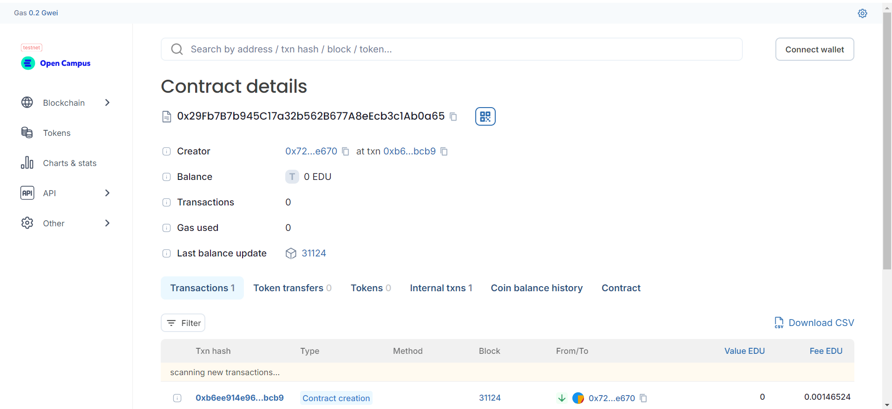

# Voting Smart Contract

 

## Vision
The Voting Smart Contract is designed to facilitate a secure, transparent, and immutable voting process on the Ethereum blockchain. This contract allows users to vote for candidates in a decentralized manner, ensuring that votes are recorded and counted in a tamper-proof system. It is ideal for elections, polls, and any scenario where secure and transparent voting is required.

### Key Functions:

1. **Constructor:** Initializes the contract with a list of candidate names.
2. **addCandidate:** Allows the owner to add new candidates to the election.
3. **vote:** Enables users to cast their vote for a candidate. Ensures each user can vote only once.
4. **getVoteCount:** Retrieves the number of votes a specific candidate has received.
5. **getCandidates:** Provides a list of all candidate names.

### Key Features:

- **Decentralized Voting:** Ensures that voting is conducted on the Ethereum blockchain, making it resistant to tampering and fraud.
- **Transparent Process:** All votes are recorded on the blockchain, providing a transparent record of the election results.
- **Owner Access Control:** Only the owner of the contract can add new candidates.
- **Single Vote Per User:** Prevents multiple votes from the same address to ensure fairness.
- **Event Emission:** Emits an event whenever a vote is cast, allowing for real-time tracking of voting activities.

## Contract Details

- **Contract Name:** Voting 
- **Network:** Edu Chain
- **Contract Address:** 0x29fb7b7b945c17a32b562b677a8eecb3c1ab0a65

  

## Future Scope

1. **Enhancements:**
   - **Voter Registration:** Implement voter registration with additional verification.
   - **Multi-stage Voting:** Add functionality for different voting phases or multiple rounds.

2. **Security Improvements:**
   - **Enhanced Security:** Incorporate advanced cryptographic techniques to further secure voting.
   - **Access Control:** Implement more granular access controls for managing candidates and elections.

3. **User Interface:**
   - **Web Application:** Develop a web app for easier interaction with the voting contract.
   - **Mobile App:** Create a mobile version to increase accessibility.

4. **Scalability:**
   - **Layer 2 Solutions:** Explore integration with Layer 2 scaling solutions to handle larger volumes of votes efficiently.

## Contact

For more information or to contribute to the project, please contact:

- **Name:** Deepshikha Choudhury
- **Email:** maudeepc@gmail.com
- **LinkedIn:** www.linkedin.com/in/deepshikha-choudhury-565a66298

